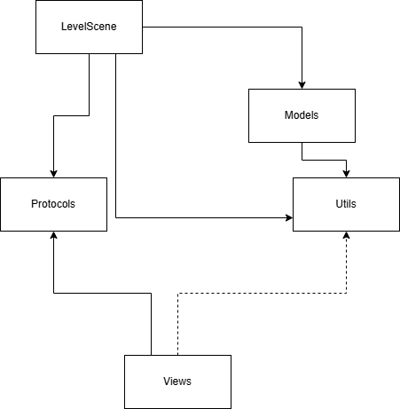
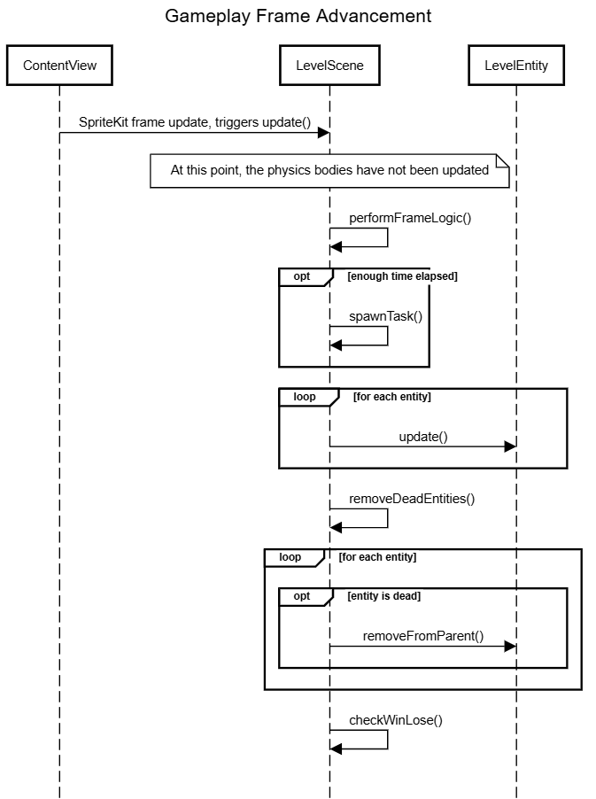
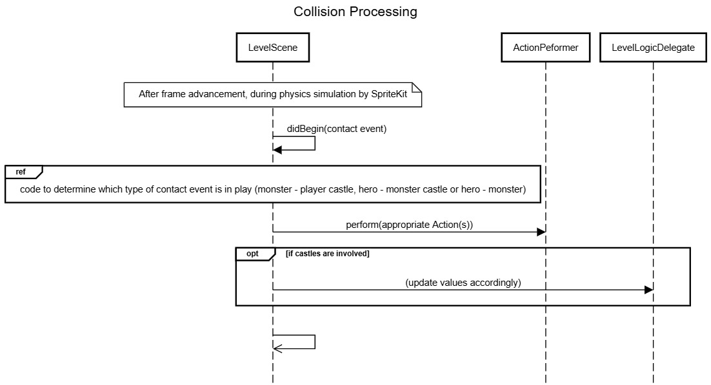
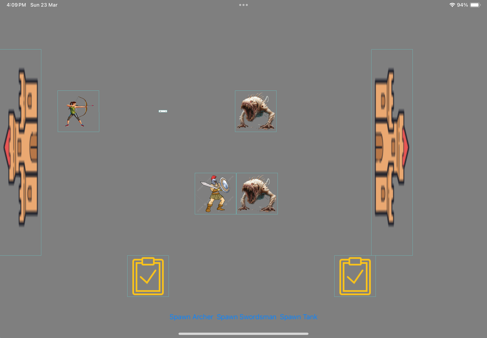

# 📘 AliceInBoredomLand — Developer Guide & Sprint Documentation

---

## I. Requirements

### 1. Overview

AliceInBoredomLand is a grid-based castle defense game where players deploy heros on tiles using resources to intercept and defeat monsters marching from the right side of the screen.\
If the player manages to destroy the monster castle, they win; while if the monster(s) manage to destroy the player castle, the player loses.\
This game supports hero placement on multiple lanes, real-time attack resolution.

### 2. Specifications

- **Grid-Based Gameplay:** The game board follows a chess-like grid system, primarily for entity spawning and sizing. However, movement is continuous and not restricted to grid locations.
- **Lane-Based Combat:** Heroes and monsters remain in fixed horizontal lanes, simplifying movement logic while retaining strategic depth.
- **Hero Deployment:** Players deploy heroes (Archer, Tank, Swordsman) by clicking buttons if they have sufficient mana. Mana is earned by tapping tasks that appear at set intervals, and some mana is given at the start.
- **Entity Statistics**: Each hero or monster has an health, attack and speed value, that respectively defines how much damage it can take before dying, how much damage it can deal in a single attack, and how fast it can move.
- **Projectile Mechanics:** Archers fire arrows at enemies within range, adhering to cooldown mechanics.
- **Physics-Based Interactions:** Collision and contact detection governs interactions between arrows, monsters, castles, and heroes.\
All collision bounding boxes are rectangles, matching visual node sizes.\
Heroes and monsters stack upon meeting opposition, leading to group damage interactions for melee units.\
- **Contact Handling:** Distinction between collision and contact is minimal for now but may evolve.\
Melee attacks currently damage all stacked enemies within contact.\
Ranged attacks despawn immediately upon hitting a valid target.\

### 3. User Manual

- **Start Game**: Game auto-launches upon running the app.
- **Deploy Hero**: Tap the button in the UI to spawn the corresponding hero in the given location, this does not work if there is insufficient mana.
- **Task Completion**: Tap the tasks as they appear from the right to gain resources that can be used to summon heroes.
- **Combat**: Occurs automatically in real time.
- **Victory/Loss**: Shown via modal alert.
- **Platform**: iOS 16+, landscape only.
- **Limitations**: No persistent save, sound or animations yet. Restart feature is currently buggy and does not fully work.

---

## II. Design

### 1. Overview

#### Top-Level Organization and Key Classes

- The class within `LevelScene` and its extensions orchestrates the game loop, spawning, updates, and interactions.
- The `Model` folder contains model information for the rest of the game, and also has the subfolders `Level Entities` and `Actions` that contain classes pertaining to the heros and monsters involved, and what these can perform respectively.
    - `EntityFactory` instantiates entities based on type.
    - `LevelEntity` is the base type for all dynamic objects.
    - Game state stored and manipulated to UI display via `LevelLogic` (conforming to `LevelLogicDelegate`).
- `Protocols`, `Utils` and `Extensions` respectively contain useful protocols for conforming to, utility functions that don't fit in any particular category, and extensions to native classes that are needed to make the code work.
- `Adapter` is currently unused, but otherwise allows for classes to be adapted into a form that complies with other protocols.
- Lastly, `View` handles displaying the model information to the user, and conveying user input to the models through `LevelScene`.

#### Libraries Used

- **SpriteKit**: Game rendering and physics.
- **SwiftUI**: UI and touch input layer.

#### Design Reasoning / Possible Alternatives

- Splitting the UI into `LevelScene` (SpriteKit framework) and `ContentView` (SwiftUI framework) allows for clear division of labor:\
`LevelScene` handles all in-game rendering and physics, while `ContentView` handles menus, HUD, and user inputs.\
This avoids cramming everything into SpriteKit or forcing SwiftUI to do physics, which it isn’t designed for, making extensions easier to perform due to SwiftUI needing less information for UI changes.\
However, this also makes synchronising state between `LevelScene` and `ContentView` more difficult, requiring the Observer Pattern to synchronise relevant data through `LevelLogicDelegate` and its concrete implementations.
- Possible alternatives include keeping UI handling entirely in `LevelScene`, which reduces the issues with handling touch detection of Tasks and Buttons in seperate places and layers, but which also makes it more likely to have too many responsibilities.
- Alternatively, there is the possibility of using `LevelScene` only for physics rendering, then transferring the entity locations as well to `ContentView` for UI rendering. However, this increases overhead and the amount of data transfer required, and does not work as well because SwiftUI does not innately support gameplay loops like SpriteKit does.

### Interesting Issues
- An attempt at making the SpriteKit library easily replacable with other libraries was made using relevant Facades, but that did not work out due to synchronisation issues between the physics and game layers.\
The game layer needed to know about the physics layer internals to make decisions, and also to modify the physics layer to implement knockback, which did not mesh well with SpriteKit's quirk of being unable to manually step through physics simulation steps to ensure both the physics changes and the game changes were appplied in an consistent order.
- Having `LevelLogic` be a StateObject in `ContentView` is not ideal as such assumes this will be created only once, but not doing so fails to have game layer changes propagate to the UI properly.
    - (Setting to `ObservableObject` to notify changes doesn't fully work out, as the changes in `LevelLogic`'s attributes does not update `ContentView` accordingly. The further workaround of setting a copy of those attributes as `Published` and then manually updating them each function call in a ViewModel works, but does not seem like a sustainable or scalable situation, due to the possibility of forgetting to update the attributes with further code modification.)

#### Likely to Change

- Level logic could support scripting for monster wave spawning, but that would likely require a `LevelSpawningDelegate` class to work properly.
- The split of how much UI work is done in `LevelScene` and how much in `ContentView` would likely be changed depending on how many future features are implemented. (Eg: The UI Buttons being moved to `LevelScene` instead)

---

### 2. Runtime Structure

#### Patterns Used

- **Factory**: `EntityFactory` instantiates level entities as needed, to take advantage of polymorphism and avoid code duplication if entities needed to be spawned from more than one location.\
Also helps with adding more hero or monster subclasses, since less places need to be updated to integrate new functionality fully and correctly.
- **Delegate**: `LevelLogicDelegate` for external logic control, and to facilitate hiding of internal details of `LevelScene` by restricting exposure to this delegate.\
Further allows for easy implementation of difficulty modes by creating new classes that modify how the win/lose conditions are calculating, and the impact of decreasing or increasing castle health.\
Also allows for difficulty to be decoupled from monster spawning patterns between different levels in the future, and other additions like Time Attack Modes or special gameplay modes.
- **Command**: `Action` and `ActionPerformer` Allows for the decoupling of the nature of a `Hero` and what they can do, which makes implementing an upgrade system much easier in the future.\
This also allows for the easy integration of a damage effectiveness system, by modifying the attack given before putting that as a variable into a `DamageAction`.
Likewise also allows new types of attacks, healing, or debuffs to be easily implemented by a new subclass of `Action`.
- **Observer**: As mentioned above, `StateObject` and `LevelLogicDelegate` allows for relevant variables in the UI to automatically update when they are changed in a scalable manner, enabling the separation between Level Logic and UI Logic to be cleaner.\
Should the UI implementation be stable enough, this also allows for partitioning of work between gameplay functionality, and UI modifications regarding said functionality.

---

## IV. Testing

### Strategy / Specifications

Overall Strategy would be Black Box testing with shifting into Grey Box testing by modifying internal variables as needed to see the more extreme situations and test them for bugs.\
Run-Time Assertions were done where feasible, mostly during spawning entities within the boundaries of the grid given.\
The main type of errors expected to be found are those that noticeably affect user experience, but with a initial logging system this will likely expand somewhat to numerical errors or synchronisation issues.\
However, given that the most important type of errors in a game are those that affect user experience, this should be sufficient.

- Manual playtesting for behavior validation, combined with logs to ensure event order is processed correctly.\
(Much of the unit testing cannot be easily done, as the full gameplay loop and corresponding integrated testing is needed to ensure correct functionality. However, replacing LevelScene with a stub is not likely to work due to SpriteKit using an unknown system to simulate physics movements)
    - Test that multiple monsters or heros in the same location does not cause them to spill over into separate lanes.
    - Test that ~20 heros and monsters do not cause the gameplay to noticeably lag.
    - Test that there is a cooldown between attacks, by referencing the logs if necessary.
    - Test that it is possible to have both monsters and heros be defeated and despawn.
    - Test that it is possible to win and to lose.
    - Test that the restart functionality works as intended, even if repeated multiple times.
    - Test that tapping a task in time causes mana to increase.
    - Test that not tapping a task causes it to eventually despawn from screen.
    - Test that tasks periodically spawn at a fixed rate, regardless of whether they are tapped or not.
    - Test that tapping each of the hero spawn buttons works if there is sufficient mana and decreases it accordingly, but does nothing if there is insufficient mana.
- Unit tests planned for `Grid` calculations to ensure the methods run correctly: `getPosition` should return the bottom left point of the grid square after accounting for lane spacing, `getNodeSize` should return a size that covers the input x and y grids, inlcuding lane spacing, and `adjustNodeOrigin` should input a position for the node that accounts for said position being interpreted as the center point of the node in question.
- Programatically check that `LevelEntity`'s `takeDamage()` does cause the entity to take damage, and that each of the `Action` subclasses perform the intended results.
- Programatically check that the `EntityFactory` produces the right types of classes with the appropriate attributes for each possible combination of inputs.

---

## V. Reflection

### 1. Evaluation

- We managed to deal with the issue of merge conflicts between independent work leading to loss of concurrency by splitting up the report and code work instead, since there was a lack of separate components for us to individually work on without rippling into other components eventually.
- Deadlines are barely on time due to end of semester rush, but should be able to submit in time.

### 2. Lessons

- Sometimes it is good to revert to prior commits if changes are sufficiently difficult to untangle, even if that seems like wasting work.
- Working on independent branches to avoid merge conflicts during commits is not a very good solution, save as a way of demonstrating possibly divergent visions on possible solutions and then picking one to keep.

## VI. Appendix

### Task List

- (TBD)

### GUI Sketches

